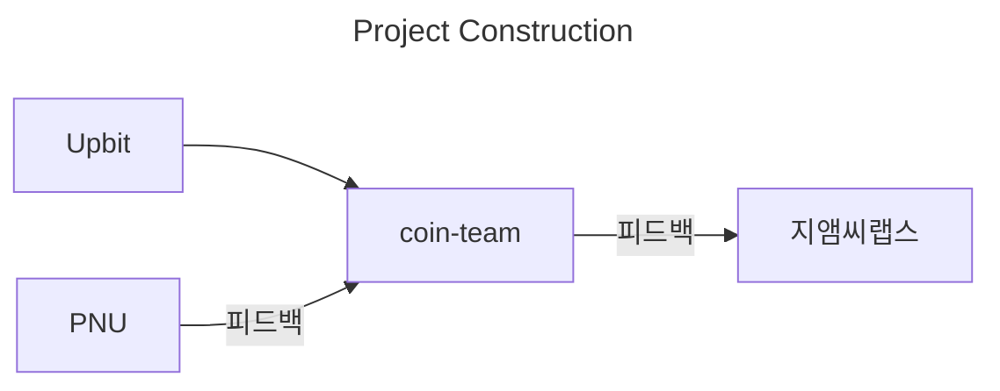
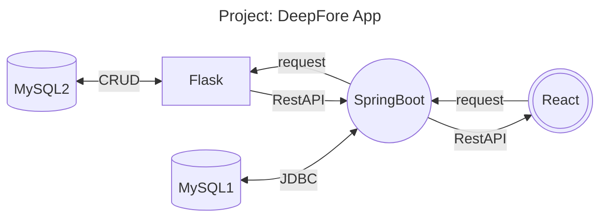

# 1. 프로젝트 개요
## 프로젝트 주제 및 선정 배경
본 프로젝트는 가상자산 시장에서 코인의 지표 데이터를 분석하여 가격을 예측하고 방향성(상승, 하락)에 대한 확률을 계산하여 퀀트 전략 알고리즘의 기본 토대를 만드는 것을 목표로 한다.

최근 가상자산 시장의 급격한 성장으로 인해 많은 개인 투자자들이 가상자산에 대한 투자를 시도하고 있지만, 전문적인 지식과 정보 부족으로 인해 많은 투자 실패 사례가 발생하고 있다. 이에 본 프로젝트는 가상자산 시장에 대한 접근성을 높이고, 지표 분석과 예측 즉, 딥러닝 솔루션 중 CNN과 LSTM을 활용하여 코인의 지표 데이터를 분석하고 예측 모델을 구축함으로 가상자산에 대한 투자에 대한 전문성과 정보를 제공할 것이다. 

이를 통해, 시장에서 일어나는 변화와 흐름을 더 정확하게 파악하고, 이를 기반으로 퀀트 전략 알고리즘을 만들어 높은 수익률을 도출할 것이다.

> 지엠씨랩스(GMC LABS)는 Good Man Company의 줄임말로, 좋은 사람들이 모여 혁신에 집중하고자 하는 곳입니다.  지엠씨랩스의 트레이딩 시스템은 “누구나 쉽고 간편하게 디지털 자산 재테크를 할 수 있어야 한다.”는  철학으로 탄생했습니다.

> 재테크를 하는 사람들의 절대 다수는 평범한 사람들입니다. 우리는 평범한 사람들을 위한 쉬운 재테크 서비스를 만들고자 고민했습니다. 자본의 유한성을 인지하고 소액 투자가 가능할 것. 이용에 합리적인 가격을 제시할 것. 무엇보다 일상을 해치지 않도록 할 것.

> 그래서 지엠씨랩스의 트레이딩 시스템은 다양한 코인들의 차트 분석과 알고리즘을 이용하여 알아서 거래를 합니다.  덕분에 사용자는 디지털 자산에 대해 잘 모르더라도, 직접 거래를 해본 적이 없어도 무리 없이 사용할 수 있습니다.  

> 트레이딩 시스템을 통해 사람들이 건강한 투자 습관을 만들고, 일상 속에서 더욱 나 다운 시간을 보낼 수 있을 거라고 믿습니다.

> 나아가 디지털 자산도 투자자산으로써 충분한 가치가 있으며 건강하고 안정적으로 투자할 수 있다는 것을 알리고,  디지털 자산 재테크의 대중화를 실현하고자 합니다.

---

## 2. 프로젝트 구조

## 3. 프로젝트 구성

## 4. 개발환경
- Python 3.10
- TensorFlow 3.0
- jdk 17
- Spring Boot 3.0.6
- React latest(18.2.0)
- MySQL latest(8.0)

## 5. 프로젝트 결과물
### 제출내용
1. **문서**
	- 기획서:
	- 보고서:
		- **요구사항 명세**
			1. 웹 서비스 명세 기획
				- 요구사항: 기능 위주
				- DB 설계: 
				- Class 설계:
				- API 설계: 초반에 가능
				- UI 설계: 초반에 가능
				- Test 계획
			2. 빅데이터 AI 기획
				- 데이터 기획
				- 데이터 수집
				- 데이터 전처리
				- 모델링
	-  ppt(수행결과: k-digital)

3. **etc**
	- 시연 동영상(ex. 광고)
	- url